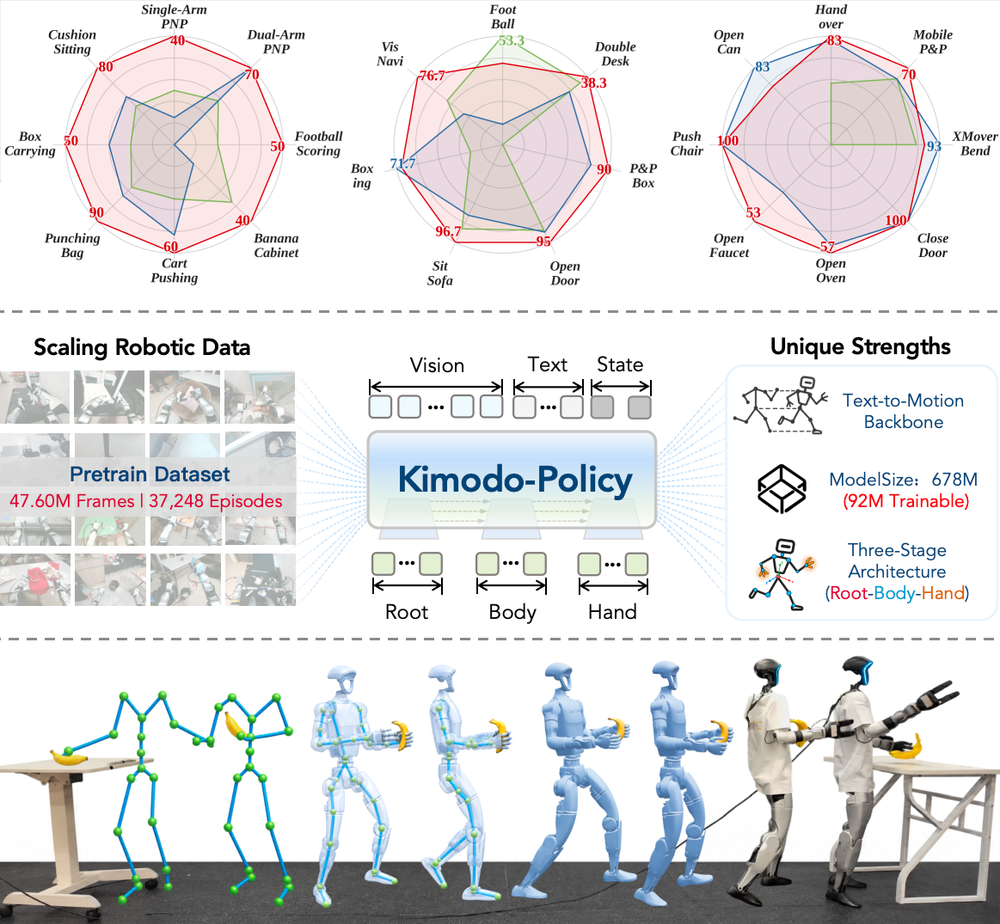

<h1 align="center">
  Kimodo-Policy: From Text-to-Motion Generators to 
  Humanoid Vision-Language-Action Policies
</h1>

  
  
  
  
  

  

Kimodo-Policy is a vision-conditioned policy for whole-body manipulation with the G1 humanoid. This repository contains the policy model, training launchers, dataset adapters, and simulation evaluation tools for HumanoidArena and SIMPLE. Large model checkpoints and datasets are distributed separately.

The policy is built on a frozen Kimodo motion backbone. DINOv3 extracts image features, and a ControlNet injects visual conditioning into the action denoising network. Hand control is handled by a separate head. The standard configurations run at 30 FPS with a 100-frame history and a 50-frame action chunk; refer to the selected YAML file for exact settings.

- Code: [Yunheng-Wang/kimodo-policy](https://github.com/Yunheng-Wang/kimodo-policy)
- Pretrained and task checkpoints: [Hugging Face model repository](https://huggingface.co/YunhengWang/kimodo-policy/tree/main)
- Training launchers: [scripts/](scripts/)
- Evaluation guides: [HumanoidArena](evaluation/humanoidarena_eval.md) and [SIMPLE](evaluation/simple_eval.md)

## Contents

- [Repository Layout](#repository-layout)
- [Environment Setup](#environment-setup)
- [Model Checkpoints](#model-checkpoints)
- [Data Preparation](#data-preparation)
- [Training](#training)
- [Inference and Evaluation](#inference-and-evaluation)
- [Real-World Deployment](#real-world-deployment)
- [Troubleshooting](#troubleshooting)

## Repository Layout

| Path | Description |
| --- | --- |
| train.py, train.yaml | General training entry point and default configuration. Use the experiment-specific YAML for released runs. |
| model/, motion/, skeleton/ | Kimodo policy, visual ControlNet, motion representations, and the G1 skeleton. |
| data/ | Dataset adapters for HumanoidArena, SIMPLE, HIW500, HumanoidEveryday, UnifoLM, and RealWorld data. |
| scripts/Pre_Train/ | Multi-source pretraining launchers. |
| scripts/HumanoidArena_Multi_Task/ | HumanoidArena SONIC multi-task training and fine-tuning. |
| scripts/HumanoidArena_Single_Task/ | HumanoidArena single-task training and fine-tuning. |
| scripts/Simple_Single_Task/ | SIMPLE single-task continuous-hand fine-tuning. |
| scripts/Real_World/ | Offline RealWorld fine-tuning launcher. |
| evaluation/ | Kimodo inference-server and simulator evaluation launchers. |
| HumanoidArena/ | HumanoidArena simulator, evaluation, and dataset tools. |
| SIMPLE/ | SIMPLE simulator and task code. |
| checkpoints/ | Local base-model and vision/text-pretraining dependencies; download them from the model repository. |
| log/, eval_results/ | Training outputs and evaluation results; excluded from Git by default. |

## Environment Setup

### General Requirements

- Linux, an NVIDIA GPU, and a CUDA-compatible PyTorch installation.
- Training launchers use BF16 by default. Use a GPU with BF16 support and install a PyTorch CUDA wheel compatible with the host driver.
- Git LFS is required for large model files. Git submodules are required for the vendored external code.
- The repository does not currently provide a single root requirements.txt or a locked training environment. The commands below install the main dependencies used directly by the training code; select PyTorch and Python wheels that match your CUDA and driver versions.

Clone the repository and initialize external code:

~~~bash
git clone --recurse-submodules https://github.com/Yunheng-Wang/kimodo-policy.git
cd kimodo-policy
git lfs install
git submodule update --init --recursive
~~~

### Kimodo Training Environment

Keep model training and the Kimodo inference service in a dedicated Conda environment. The code uses Python 3.10+ syntax, and the SIMPLE integration environment is pinned to Python 3.10.

~~~bash
conda create -n kimodo-env python=3.10 -y
conda activate kimodo-env
python -m pip install --upgrade pip

# Install PyTorch using the NVIDIA driver/CUDA combination on your machine.
# Choose the matching wheel at https://pytorch.org/get-started/locally/
pip install accelerate omegaconf wandb numpy av pyarrow scipy einops \
  pydantic safetensors transformers peft tqdm packaging
~~~

Training launchers use Accelerate for multi-GPU execution. Set KIMODO_ENV so the launchers can locate Accelerate from the active environment:

~~~bash
export KIMODO_ENV="$CONDA_PREFIX"
python -c "import torch; print(torch.__version__, torch.cuda.is_available())"
accelerate --version
~~~

The pretraining configurations precompute text embeddings, so LLM2Vec/Llama weights must be available. DINOv3 and the Kimodo motion backbone must also be placed under the repository checkpoints/ directory. See Model Checkpoints below.

### HumanoidArena Simulation Environment

HumanoidArena simulation evaluation uses a separate Isaac Sim/Isaac Lab environment. The included setup documentation targets Ubuntu 22.04+, Isaac Sim 5.0.0, and Isaac Lab release/2.2.0, with Python 3.11 and PyTorch 2.7.0/CUDA 12.8. The setup helper prints commands by default:

~~~bash
cd HumanoidArena
bash isaaclab_twist2_g1/tools/setup_humanoidarena_envs.sh --dry-run
~~~

Review the output, then run the installation:

~~~bash
CONDA_BASE=/path/to/conda bash isaaclab_twist2_g1/tools/setup_humanoidarena_envs.sh --execute
~~~

The default environment name is unitree_sim_env. Evaluation also requires the HumanoidArena simulation assets and SONIC policy artifacts. Download locations, directory layout, and the complete installation procedure are documented in [HumanoidArena Environment Setup](HumanoidArena/docs/04_environment_setup.md). The evaluation code treats HumanoidArena/ as the simulator project root. Native HumanoidArena LeRobot training requires a separate lerobot environment and is outside the Kimodo training and evaluation workflow documented here.

### SIMPLE Simulation Environment

SIMPLE provides its own Python 3.10 environment definition with PyTorch 2.7.0, TorchVision 0.22.0, and NumPy 1.26.4. The upstream baseline targets Ubuntu 22.04, Isaac Sim 4.5/MuJoCo 3.3, CUDA 12, and NVIDIA driver 535+. An RTX 3080 Ti/4090 or better is recommended, with at least 100 GB of free disk space. Keep the SIMPLE simulator environment separate from kimodo-env.

~~~bash
cd SIMPLE
# Install uv according to the SIMPLE documentation.
UV_HTTP_TIMEOUT=3000 GIT_LFS_SKIP_SMUDGE=1 \
  uv sync --all-groups --index-strategy unsafe-best-match
bash scripts/install_curobo.sh
~~~

The CuRobo CUDA extension requires a local CUDA toolkit and a matching GPU architecture; the first build may take some time. See [SIMPLE Installation](SIMPLE/docs/source/tutorials/installation.md) for system dependencies, optional assets, and installation details. To download the minimal SIMPLE scene resources, run bash scripts/pre-minimal-download.sh from the SIMPLE root.

The current SIMPLE configuration targets Isaac Sim 4.5/MuJoCo 3.3, and pyproject.toml intentionally does not install Isaac Sim. Full evaluation still requires a compatible Isaac Sim runtime. SIMPLE/scripts/install_isaaclab.sh assumes that SIMPLE/third_party/IsaacLab has already been checked out; the current release tree does not include that directory or its submodule metadata. Prepare a compatible Isaac Lab checkout before using that workflow. The evaluation launchers start the simulator with SIMPLE/.venv/bin/python; if that environment lacks transformers or safetensors, set KIMODO_MODEL_SITE_PACKAGES to a Python 3.10 site-packages directory that contains them.

## Model Checkpoints

All Kimodo training checkpoints and base model weights are hosted in [YunhengWang/kimodo-policy](https://huggingface.co/YunhengWang/kimodo-policy/tree/main). The Git repository does not include these large files. The model repository follows the relative paths shown below.

### Download Base Models

From the repository root:

~~~bash
python -m pip install --upgrade huggingface_hub
python - <<'PY'
from huggingface_hub import snapshot_download

snapshot_download(
    repo_id="YunhengWang/kimodo-policy",
    repo_type="model",
    local_dir=".",
    allow_patterns=["checkpoints/**"],
)
PY
~~~

Expected base-model layout:

~~~text
checkpoints/
├── Kimodo-G1-RP-v1/                         # Default Kimodo motion backbone
├── Kimodo-G1-SEED-v1/                       # Backbone used by the SEED experiments
├── dinov3-vitl16-pretrain-lvd1689m/         # DINOv3 image encoder
├── LLM2Vec-Meta-Llama-3-8B-Instruct-mntp/  # LLM2Vec base model
├── LLM2Vec-Meta-Llama-3-8B-Instruct-mntp-supervised/
└── Meta-Llama-3-8B-Instruct/               # Llama base weights and tokenizer
~~~

Fine-tuning requires a pretrained training checkpoint in addition to the base models. The following example downloads the released 419h, 1,000,000-step pretraining checkpoint:

~~~bash
python - <<'PY'
from huggingface_hub import snapshot_download

snapshot_download(
    repo_id="YunhengWang/kimodo-policy",
    repo_type="model",
    local_dir=".",
    allow_patterns=[
        "Pre_Train/pt_419h_gbs1024_100w_controlnet4_detach_true_mse/2026-08-26_17-06-35/checkpoint_1000000/**"
    ],
)
PY
~~~

The resulting checkpoint path is:

~~~text
Pre_Train/pt_419h_gbs1024_100w_controlnet4_detach_true_mse/
└── 2026-08-26_17-06-35/
    └── checkpoint_1000000/
        ├── config.json
        ├── training_state.pt
        └── ...
~~~

Inference and fine-tuning entry points require at least config.json and training_state.pt in the checkpoint directory. Use --init-checkpoint to initialize a new task from a trained model, and --resume to continue the same training run. Exact distributed RNG recovery also requires the corresponding rng_state_rank_*.pt files, so downloading the complete checkpoint directory is recommended.

### Released Checkpoint Catalog

The directories below are available in the model repository (checked on 2026-10-04). Open a link, enter the experiment directory, and select a date and checkpoint_<step>. Download a checkpoint that matches the evaluation task.

| Use | Hugging Face directory | Published checkpoints |
| --- | --- | --- |
| Shared base-model dependencies | [checkpoints/](https://huggingface.co/YunhengWang/kimodo-policy/tree/main/checkpoints) | Kimodo-G1-RP-v1, Kimodo-G1-SEED-v1, DINOv3, Llama/LLM2Vec |
| Base pretraining | [Pre_Train/pt_419h_gbs1024_100w_controlnet4_detach_true_mse](https://huggingface.co/YunhengWang/kimodo-policy/tree/main/Pre_Train/pt_419h_gbs1024_100w_controlnet4_detach_true_mse) | 200k, 400k, 600k, 800k, 1,000k |
| HumanoidArena multi-task, 105h initialization | [ft_105h...](https://huggingface.co/YunhengWang/kimodo-policy/tree/main/HumanoidArena_Multi_Task/ft_105h_humanoidarena_sonicx7_gbs128_50w_controlnet4_detach_true_mse) | 100k, 200k, 300k, 400k, 500k |
| HumanoidArena multi-task, 419h initialization | [ft_419h...](https://huggingface.co/YunhengWang/kimodo-policy/tree/main/HumanoidArena_Multi_Task/ft_419h_humanoidarena_sonicx7_gbs128_50w_controlnet4_detach_true_mse) | 100k, 200k, 300k, 400k, 500k |
| HumanoidArena multi-task, base variant | [SONIC x7](https://huggingface.co/YunhengWang/kimodo-policy/tree/main/HumanoidArena_Multi_Task/humanoidarena_sonicx7_gbs128_50w_controlnet4_detach_true_mse) | 500k |
| HumanoidArena multi-task, SEED backbone | [SONIC x7 SEED](https://huggingface.co/YunhengWang/kimodo-policy/tree/main/HumanoidArena_Multi_Task/humanoidarena_sonicx7_gbs128_50w_controlnet4_detach_true_mse_SEED) | 500k |
| HumanoidArena multi-task, hand-head variants | [large_hand4](https://huggingface.co/YunhengWang/kimodo-policy/tree/main/HumanoidArena_Multi_Task/humanoidarena_sonicx7_gbs128_50w_controlnet4_detach_true_mse_large_hand4) and [large_hand8](https://huggingface.co/YunhengWang/kimodo-policy/tree/main/HumanoidArena_Multi_Task/humanoidarena_sonicx7_gbs128_50w_controlnet4_detach_true_mse_large_hand8) | 500k each |
| HumanoidArena single-task, from scratch | [double desk](https://huggingface.co/YunhengWang/kimodo-policy/tree/main/HumanoidArena_Single_Task/humanoidarena_single_gbs64_20w_controlnet4_detach_true_mse_HOI_double_desk_sonic), [football](https://huggingface.co/YunhengWang/kimodo-policy/tree/main/HumanoidArena_Single_Task/humanoidarena_single_gbs64_20w_controlnet4_detach_true_mse_HOI_football_sonic), [pp box](https://huggingface.co/YunhengWang/kimodo-policy/tree/main/HumanoidArena_Single_Task/humanoidarena_single_gbs64_20w_controlnet4_detach_true_mse_HOI_pp_box_sonic), [boxing](https://huggingface.co/YunhengWang/kimodo-policy/tree/main/HumanoidArena_Single_Task/humanoidarena_single_gbs64_20w_controlnet4_detach_true_mse_HSI_boxing_sonic), [open door](https://huggingface.co/YunhengWang/kimodo-policy/tree/main/HumanoidArena_Single_Task/humanoidarena_single_gbs64_20w_controlnet4_detach_true_mse_HSI_open_door_sonic), [sit sofa](https://huggingface.co/YunhengWang/kimodo-policy/tree/main/HumanoidArena_Single_Task/humanoidarena_single_gbs64_20w_controlnet4_detach_true_mse_HSI_sit_sofa_sonic), [vision navi](https://huggingface.co/YunhengWang/kimodo-policy/tree/main/HumanoidArena_Single_Task/humanoidarena_single_gbs64_20w_controlnet4_detach_true_mse_HSI_vision_navi_sonic) | 200k each |
| HumanoidArena single-task, 419h initialization | [double desk](https://huggingface.co/YunhengWang/kimodo-policy/tree/main/HumanoidArena_Single_Task/ft_419h_humanoidarena_single_gbs64_20w_controlnet4_detach_true_mse_HOI_double_desk_sonic), [football](https://huggingface.co/YunhengWang/kimodo-policy/tree/main/HumanoidArena_Single_Task/ft_419h_humanoidarena_single_gbs64_20w_controlnet4_detach_true_mse_HOI_football_sonic), [pp box](https://huggingface.co/YunhengWang/kimodo-policy/tree/main/HumanoidArena_Single_Task/ft_419h_humanoidarena_single_gbs64_20w_controlnet4_detach_true_mse_HOI_pp_box_sonic), [boxing](https://huggingface.co/YunhengWang/kimodo-policy/tree/main/HumanoidArena_Single_Task/ft_419h_humanoidarena_single_gbs64_20w_controlnet4_detach_true_mse_HSI_boxing_sonic), [open door](https://huggingface.co/YunhengWang/kimodo-policy/tree/main/HumanoidArena_Single_Task/ft_419h_humanoidarena_single_gbs64_20w_controlnet4_detach_true_mse_HSI_open_door_sonic), [sit sofa](https://huggingface.co/YunhengWang/kimodo-policy/tree/main/HumanoidArena_Single_Task/ft_419h_humanoidarena_single_gbs64_20w_controlnet4_detach_true_mse_HSI_sit_sofa_sonic), [vision navi](https://huggingface.co/YunhengWang/kimodo-policy/tree/main/HumanoidArena_Single_Task/ft_419h_humanoidarena_single_gbs64_20w_controlnet4_detach_true_mse_HSI_vision_navi_sonic) | 200k each |
| SIMPLE single-task, continuous hand | [CloseDoor](https://huggingface.co/YunhengWang/kimodo-policy/tree/main/Simple_Single_Task/ft_simple_single_gbs64_20w_controlnet4_detach_true_mse_continuous_hand_G1WholebodyCloseDoorTeleop-v0), [Handover](https://huggingface.co/YunhengWang/kimodo-policy/tree/main/Simple_Single_Task/ft_simple_single_gbs64_20w_controlnet4_detach_true_mse_continuous_hand_G1WholebodyHandoverTeleop-v0), [LocomotionPickBetweenTables](https://huggingface.co/YunhengWang/kimodo-policy/tree/main/Simple_Single_Task/ft_simple_single_gbs64_20w_controlnet4_detach_true_mse_continuous_hand_G1WholebodyLocomotionPickBetweenTablesTeleop-v0), [OpenFaucet](https://huggingface.co/YunhengWang/kimodo-policy/tree/main/Simple_Single_Task/ft_simple_single_gbs64_20w_controlnet4_detach_true_mse_continuous_hand_G1WholebodyOpenFaucetTeleop-v0), [OpenOven](https://huggingface.co/YunhengWang/kimodo-policy/tree/main/Simple_Single_Task/ft_simple_single_gbs64_20w_controlnet4_detach_true_mse_continuous_hand_G1WholebodyOpenOvenTeleop-v0), [OpenTrashCan](https://huggingface.co/YunhengWang/kimodo-policy/tree/main/Simple_Single_Task/ft_simple_single_gbs64_20w_controlnet4_detach_true_mse_continuous_hand_G1WholebodyOpenTrashCanTeleop-v0), [PushOfficeChair](https://huggingface.co/YunhengWang/kimodo-policy/tree/main/Simple_Single_Task/ft_simple_single_gbs64_20w_controlnet4_detach_true_mse_continuous_hand_G1WholebodyPushOfficeChairTeleop-v0), [XMoveBendPick](https://huggingface.co/YunhengWang/kimodo-policy/tree/main/Simple_Single_Task/ft_simple_single_gbs64_20w_controlnet4_detach_true_mse_continuous_hand_G1WholebodyXMoveBendPickTeleop-v0) | 200k each |
| Real_World | [Model repository](https://huggingface.co/YunhengWang/kimodo-policy/tree/main) | No released Real_World training checkpoint at this time |

HumanoidArena and SIMPLE single-task directories contain separate task-named subdirectories. The checkpoint_200000 directory inside each experiment directory is the checkpoint passed to the evaluator. The 105h/210h pretraining launchers are included in the code, but the current Hugging Face release lists the 419h pretraining run.

Kimodo, DINOv3, Llama, and LLM2Vec weights have their own license terms. Read the Hugging Face model card and upstream licenses before use or redistribution. Training data, HumanoidArena simulator assets, and SIMPLE Level evaluation data are not included in the checkpoint download steps.

## Data Preparation

Dataset roots can be overridden with environment variables or set in the experiment YAML under main.dataset_roots. Each directory must follow the format expected by its adapter in data/; an empty directory is not sufficient.

| Dataset | Environment variable | Default directory or selection |
| --- | --- | --- |
| HumanoidArena | HUMANOID_ARENA_ROOT | datasets/HumanoidArena_dataset_v3_1; multi-task configurations select the SONIC RefPose data |
| UnifoLM whole-body | UNIFOLM_ROOT | datasets/UnifoLM_WBT_Dataset; uses the head stereo-left camera |
| HumanoidEveryday | HUMANOID_EVERYDAY_ROOT | datasets/HumanoidEveryday |
| HIW500 | HIW500_ROOT | datasets/HIW500 |
| SIMPLE training data | KIMODO_SIMPLE_ROOT | datasets/Simple; the task directory is selected by the launcher argument |
| RealWorld offline data | REAL_WORLD_ROOT | real-world |

The pretraining configurations combine UnifoLM, HumanoidEveryday, and HIW500 data. They use 25%, 50%, or 100% of the available episodes through pretrain_data_fraction, corresponding to the 105h, 210h, and 419h experiment names. HumanoidArena multi-task data is selected by the YAML configuration. Single-task experiments select the task and backend through launcher arguments. The SIMPLE training-data root and the official SIMPLE Level 0/1/2 evaluation data are separate inputs; the latter is provided through SIMPLE_DATA_DIR during evaluation.

The data adapter raises an error when a path is missing, no episodes are selected, or the format is incompatible. Before a full run, use the checker to audit a sample of the data. Pass the current YAML explicitly instead of relying on an old checker default. The checker audits episode/schema information and action continuity; it does not decode video:

~~~bash
PROJECT_ROOT="$(git rev-parse --show-toplevel)"
python utils/check_datasets.py \
  --config scripts/Pre_Train/pt_419h_gbs1024_100w_controlnet4_detach_true_mse.yaml \
  --workers 1 \
  --limit 5 \
  --output "$PROJECT_ROOT/log/pretrain_dataset_audit.json"
~~~

A small-scale job is still recommended before formal training to validate video loading and GPU memory usage.

## Training

Each launcher locates the repository root and its companion YAML, then starts accelerate launch with the requested GPUs. Training outputs are saved by default as log/<task-category>/<run-name>/<timestamp>/checkpoint_<step>. Set KIMODO_GPUS to select GPUs. Pretraining launchers default to eight GPUs; the other commonly used launchers default to four. Changing the GPU count changes the global batch size, so the gbs value in a filename is only valid when the YAML process count is used.

### Launcher Overview

Each shell launcher reads the same-name YAML in its directory by default. Set KIMODO_CONFIG to use a custom configuration.

| Task | Launcher | Initialization and default output |
| --- | --- | --- |
| Pretraining | [105h](scripts/Pre_Train/pt_105h_gbs1024_100w_controlnet4_detach_true_mse.sh), [210h](scripts/Pre_Train/pt_210h_gbs1024_100w_controlnet4_detach_true_mse.sh), [419h](scripts/Pre_Train/pt_419h_gbs1024_100w_controlnet4_detach_true_mse.sh) | Starts from Kimodo base weights; log/Pre_Train/<run-name>/ |
| HumanoidArena multi-task | [from scratch](scripts/HumanoidArena_Multi_Task/humanoidarena_sonicx7_gbs128_50w_controlnet4_detach_true_mse.sh), [fine-tuning](scripts/HumanoidArena_Multi_Task/ft_humanoidarena_sonicx7_gbs128_50w_controlnet4_detach_true_mse.sh) | Fine-tuning requires a checkpoint; log/HumanoidArena_Multi_Task/<run-name>/ |
| HumanoidArena multi-task variants | [SEED](scripts/HumanoidArena_Multi_Task/humanoidarena_sonicx7_gbs128_50w_controlnet4_detach_true_mse_SEED.sh), [large_hand4](scripts/HumanoidArena_Multi_Task/humanoidarena_sonicx7_gbs128_50w_controlnet4_detach_true_mse_large_hand4.sh), [large_hand8](scripts/HumanoidArena_Multi_Task/humanoidarena_sonicx7_gbs128_50w_controlnet4_detach_true_mse_large_hand8.sh) | Variant settings are in the companion YAML; output is under log/HumanoidArena_Multi_Task/ |
| HumanoidArena single-task | [from scratch](scripts/HumanoidArena_Single_Task/humanoidarena_single_gbs64_20w_controlnet4_detach_true_mse.sh), [fine-tuning](scripts/HumanoidArena_Single_Task/ft_humanoidarena_single_gbs64_20w_controlnet4_detach_true_mse.sh) | From-scratch training takes TASK BACKEND; fine-tuning also takes CHECKPOINT; log/HumanoidArena_Single_Task/<run-name>/ |
| SIMPLE single-task fine-tuning | [continuous hand](scripts/Simple_Single_Task/ft_simple_single_gbs64_20w_controlnet4_detach_true_mse_continuous_hand.sh) | Takes TASK CHECKPOINT; log/Simple_Single_Task/<run-name>_<TASK>/ |
| RealWorld offline fine-tuning | [Real_World](scripts/Real_World/ft_real_world_single_gbs64_5w_controlnet4_detach_true_mse.sh) | Takes CHECKPOINT and an optional dataset name; log/Real_World/<run-name>_<dataset>/ |

### Multi-Source Pretraining

Download the base models and prepare the three pretraining datasets first. The 419h configuration uses the full data mixture, trains for up to 1,000,000 steps, and saves every 200,000 steps:

~~~bash
conda activate kimodo-env
export KIMODO_ENV="$CONDA_PREFIX"
PROJECT_ROOT="$(git rev-parse --show-toplevel)"
export UNIFOLM_ROOT="$PROJECT_ROOT/datasets/UnifoLM_WBT_Dataset"
export HUMANOID_EVERYDAY_ROOT="$PROJECT_ROOT/datasets/HumanoidEveryday"
export HIW500_ROOT="$PROJECT_ROOT/datasets/HIW500"

for data_root in "$UNIFOLM_ROOT" "$HUMANOID_EVERYDAY_ROOT" "$HIW500_ROOT"; do
  test -d "$data_root" || { echo "Missing dataset directory: $data_root" >&2; exit 2; }
done

KIMODO_GPUS=0,1,2,3,4,5,6,7 \
  bash scripts/Pre_Train/pt_419h_gbs1024_100w_controlnet4_detach_true_mse.sh
~~~

Use the [105h](scripts/Pre_Train/pt_105h_gbs1024_100w_controlnet4_detach_true_mse.sh) or [210h](scripts/Pre_Train/pt_210h_gbs1024_100w_controlnet4_detach_true_mse.sh) launcher for the other data fractions.

### HumanoidArena Multi-Task Training

The multi-task SONIC configuration uses the repository's seven-task Sonic RefPose training set. The following example trains from scratch; the ft launcher additionally takes an initialization checkpoint:

~~~bash
conda activate kimodo-env
export KIMODO_ENV="$CONDA_PREFIX"
PROJECT_ROOT="$(git rev-parse --show-toplevel)"
export HUMANOID_ARENA_ROOT="$PROJECT_ROOT/datasets/HumanoidArena_dataset_v3_1"
test -d "$HUMANOID_ARENA_ROOT" || { echo "Missing dataset directory: $HUMANOID_ARENA_ROOT" >&2; exit 2; }

KIMODO_GPUS=0,1,2,3 \
  bash scripts/HumanoidArena_Multi_Task/humanoidarena_sonicx7_gbs128_50w_controlnet4_detach_true_mse.sh

INIT_CKPT=/path/to/checkpoint_1000000
KIMODO_GPUS=0,1,2,3 \
  bash scripts/HumanoidArena_Multi_Task/ft_humanoidarena_sonicx7_gbs128_50w_controlnet4_detach_true_mse.sh \
  "$INIT_CKPT"
~~~

The same ft_humanoidarena_sonicx7 launcher accepts an initialization checkpoint from either the 105h or 419h pretraining run. SEED, large_hand4, and large_hand8 each have an independent configuration in [HumanoidArena_Multi_Task](scripts/HumanoidArena_Multi_Task/).

### HumanoidArena Single-Task Training

From-scratch training:

~~~bash
PROJECT_ROOT="$(git rev-parse --show-toplevel)"
export HUMANOID_ARENA_ROOT="$PROJECT_ROOT/datasets/HumanoidArena_dataset_v3_1"
test -d "$HUMANOID_ARENA_ROOT" || { echo "Missing dataset directory: $HUMANOID_ARENA_ROOT" >&2; exit 2; }
KIMODO_GPUS=0,1,2,3 \
  bash scripts/HumanoidArena_Single_Task/humanoidarena_single_gbs64_20w_controlnet4_detach_true_mse.sh \
  doubledesk sonic
~~~

Fine-tuning from a multi-source pretraining checkpoint:

~~~bash
KIMODO_GPUS=0,1,2,3 \
  bash scripts/HumanoidArena_Single_Task/ft_humanoidarena_single_gbs64_20w_controlnet4_detach_true_mse.sh \
  doubledesk sonic /path/to/checkpoint_1000000
~~~

Available tasks and backends depend on the labels present in the dataset. Common SONIC tasks are doubledesk, football, pp_box, boxing, open_door, sit_sofa, and vision_navi. The default single-task configuration uses a per-process batch size of 16 and trains for 200,000 steps.

### SIMPLE Single-Task Fine-Tuning

This workflow uses the Kimodo training environment. KIMODO_SIMPLE_ROOT must point to the formatted SIMPLE training-data root; SIMPLE simulator dependencies are only needed for evaluation:

~~~bash
conda activate kimodo-env
export KIMODO_ENV="$CONDA_PREFIX"
PROJECT_ROOT="$(git rev-parse --show-toplevel)"
export KIMODO_SIMPLE_ROOT="$PROJECT_ROOT/datasets/Simple"
test -d "$KIMODO_SIMPLE_ROOT" || { echo "Missing dataset directory: $KIMODO_SIMPLE_ROOT" >&2; exit 2; }

KIMODO_GPUS=0,1,2,3 \
  bash scripts/Simple_Single_Task/ft_simple_single_gbs64_20w_controlnet4_detach_true_mse_continuous_hand.sh \
  G1WholebodyXMovePickTeleop-v0 /path/to/checkpoint_1000000
~~~

The launcher writes the task name into the run directory, with output under log/Simple_Single_Task/. Other tasks require a matching task directory under the training-data root.

### RealWorld Offline Fine-Tuning

The offline demonstration fine-tuning launcher is in [scripts/Real_World](scripts/Real_World/). It requires a compatible dataset under REAL_WORLD_ROOT and an initialization checkpoint. The real-robot deployment workflow is not released yet; see [Real-World Deployment](#real-world-deployment).

Set KIMODO_CONFIG=/path/to/experiment.yaml to override the default YAML. Set KIMODO_GPUS to select processes. When multiple jobs run on one machine, set a different KIMODO_MASTER_PORT for each job if the default port is already in use.

## Inference and Evaluation

Evaluation checkpoints must contain both config.json and training_state.pt. The HumanoidArena and SIMPLE wrappers start the Kimodo inference server, run the corresponding simulator, and write evaluation results. The checkpoint, task environment, and evaluation data must match.

### HumanoidArena SONIC

Prepare the HumanoidArena unitree_sim_env, assets, and SONIC policy artifacts. The shell wrapper starts the simulator from KIMODO_SIM_ENV and the model server from KIMODO_SERVER_PYTHON:

~~~bash
PROJECT_ROOT="$(git rev-parse --show-toplevel)"
CONDA_BASE="$(conda info --base)"
CHECKPOINT=/path/to/downloaded/checkpoint_200000

export HUMANOIDARENA_ROOT="$PROJECT_ROOT/HumanoidArena"
export KIMODO_SIM_ENV="$CONDA_BASE/envs/unitree_sim_env"
export KIMODO_SERVER_PYTHON="$CONDA_BASE/envs/kimodo-env/bin/python"

bash evaluation/humanoidarena_eval_signal_task_sonic.sh \
  --project "$PROJECT_ROOT" \
  --task doubledesk \
  --checkpoint "$CHECKPOINT" \
  --gpus 0,1,2 \
  --seeds 0,1,2 \
  --repeats 20 \
  --dtype fp32 \
  --diffusion-steps 10 \
  --execution-frames 15 \
  --rtc 0 \
  --results-dir "$PROJECT_ROOT/eval_results/doubledesk"
~~~

For continuous multi-task evaluation, use [humanoidarena_eval_multi_task_sonic.sh](evaluation/humanoidarena_eval_multi_task_sonic.sh) and pass tasks in order with --task doubledesk football pp_box. TWIST2 uses the independent [humanoidarena_eval_signal_task_twist2.sh](evaluation/humanoidarena_eval_signal_task_twist2.sh) wrapper. See [HumanoidArena Evaluation](evaluation/humanoidarena_eval.md) for seeds, RTC, video recording, and reporting parameters.

### SIMPLE Level 0/1/2

The SIMPLE evaluation wrapper starts the simulator with SIMPLE/.venv/bin/python. SIMPLE_DATA_DIR must point to the SIMPLE data root containing simulator resources and official Level data. The wrapper looks for simple-eval/<task>/dr-level-0/, dr-level-1/, and dr-level-2/ under that root; some releases use level-0/1/2 names instead. Each Level directory must contain meta/episodes.jsonl.

~~~bash
PROJECT_ROOT="$(git rev-parse --show-toplevel)"
CONDA_BASE="$(conda info --base)"
CHECKPOINT=/path/to/Simple_Single_Task/checkpoint_200000
export SIMPLE_DATA_DIR=/path/to/simple-eval-data
# Set this only when SIMPLE/.venv lacks transformers or safetensors.
export KIMODO_MODEL_SITE_PACKAGES="$CONDA_BASE/envs/kimodo-env/lib/python3.10/site-packages"

bash evaluation/simple_eval_signal_task_sonic.sh \
  --task G1WholebodyXMoveBendPickTeleop-v0 \
  --checkpoint "$CHECKPOINT" \
  --gpus 0,1,2 \
  --levels 0,1,2 \
  --seeds 0 \
  --episodes 10 \
  --simple-data-dir "$SIMPLE_DATA_DIR" \
  --dtype fp32 \
  --diffusion-steps 10 \
  --execution-frames 15 \
  --rtc 0 \
  --max-navigation-speed 10.0 \
  --max-steps auto \
  --results-dir "$PROJECT_ROOT/eval_results/simple_xmove_bendpick"
~~~

Official Level data must match --task, and each Level usually contains fixed environment episodes. The SIMPLE task selects the Teleop/SONIC or motion-planning/AMO action adapter; do not evaluate a checkpoint from one controller family by changing only the task string. See [SIMPLE Evaluation](evaluation/simple_eval.md) for the complete input layout, episode outputs, videos, and success-rate statistics.

Evaluation outputs are written to eval_results/ by default. HumanoidArena wrappers produce summary.json, final.csv, per-episode results, and optional videos. SIMPLE wrappers save logs, statistics, and videos separately for each Level. Use a separate --results-dir for each formal experiment.

## Real-World Deployment

**Coming in a future release.** Hardware configuration, deployment dependencies, launch commands, and safety procedures are not included yet.

## Troubleshooting

**Kimodo or DINOv3 weights cannot be found**

Confirm that checkpoints/ is at the repository root and contains Kimodo-G1-RP-v1/config.yaml, Kimodo-G1-RP-v1/model.safetensors, and dinov3-vitl16-pretrain-lvd1689m/. The SEED configurations additionally require Kimodo-G1-SEED-v1/.

**The checkpoint is incomplete**

Inference and fine-tuning use a training output directory such as checkpoint_<step>, not a base-model directory containing only model.safetensors. Check that the checkpoint includes config.json and training_state.pt.

**A dataset path error is reported**

Set HUMANOID_ARENA_ROOT, UNIFOLM_ROOT, HUMANOID_EVERYDAY_ROOT, HIW500_ROOT, or KIMODO_SIMPLE_ROOT to real dataset paths. A path can exist and still fail if it contains no compatible episodes; inspect dataset_selection in the selected YAML and the matching data/*_loader.py.

**SIMPLE evaluation cannot find model dependencies**

Evaluation uses SIMPLE/.venv/bin/python by default. Confirm that the uv environment is installed. If transformers or safetensors are available only in the Kimodo Conda environment, set KIMODO_MODEL_SITE_PACKAGES.

**Resume interrupted training**

Use the same configuration and dataset roots, then run train.py --resume /path/to/checkpoint_STEP to restore the optimizer, scheduler, and global step. To initialize a new task from a pretrained model, use the checkpoint argument of the corresponding launcher; internally it is passed as --init-checkpoint, so the new run starts with a fresh optimizer state.
